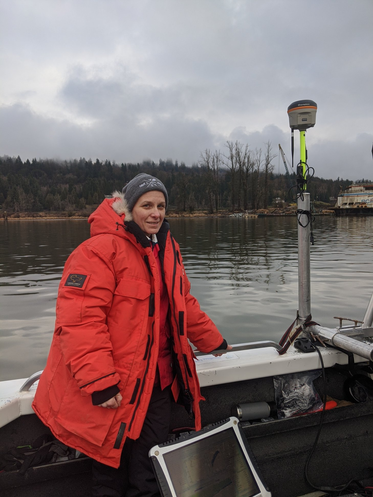

Adrienne Ducharme from Palmer was working with TGAEC on the Fraser River Sturgeon Habitat Assessment. We were measuring water velocities and depths while another vessel collected side-scan sonar images of sturgeon. A derelict BC ferry is in the background.

===

Here is some more blog content.